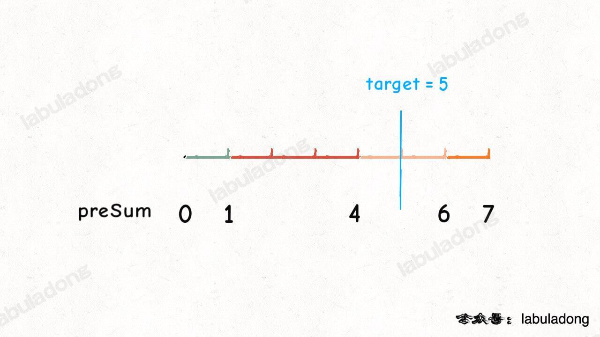
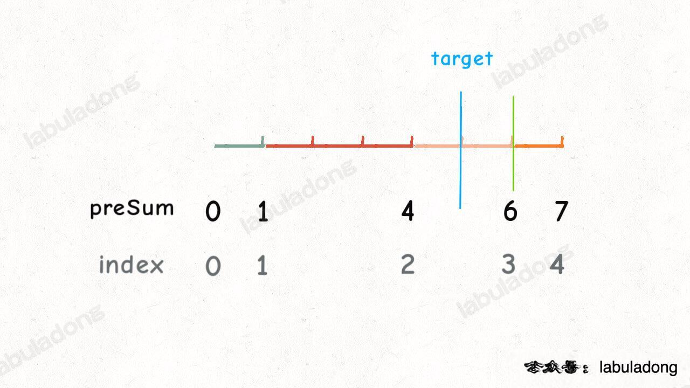
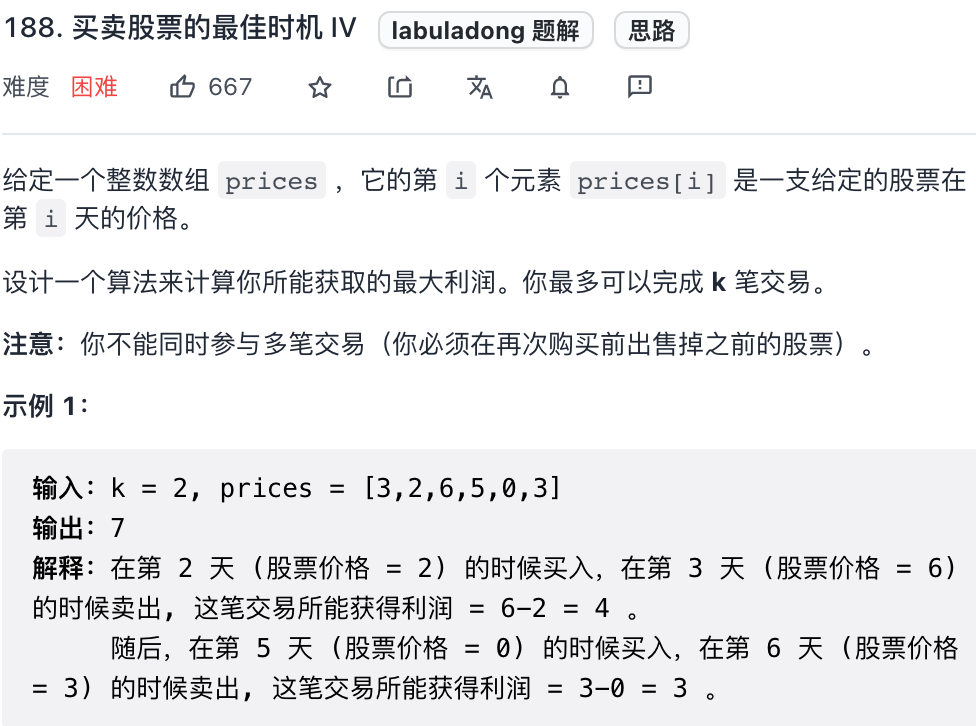
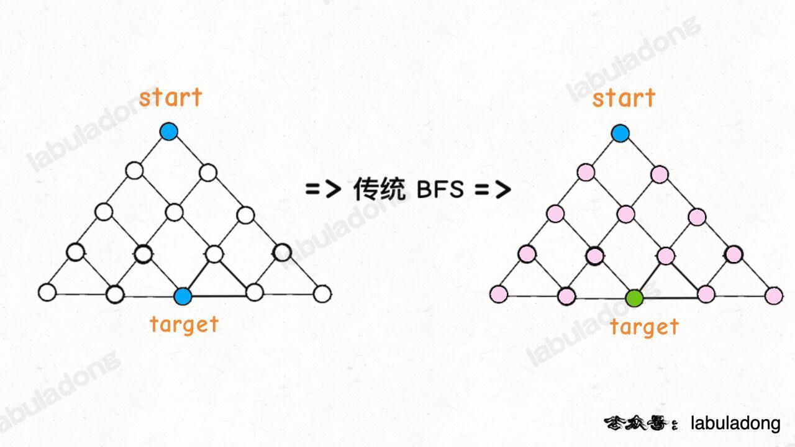
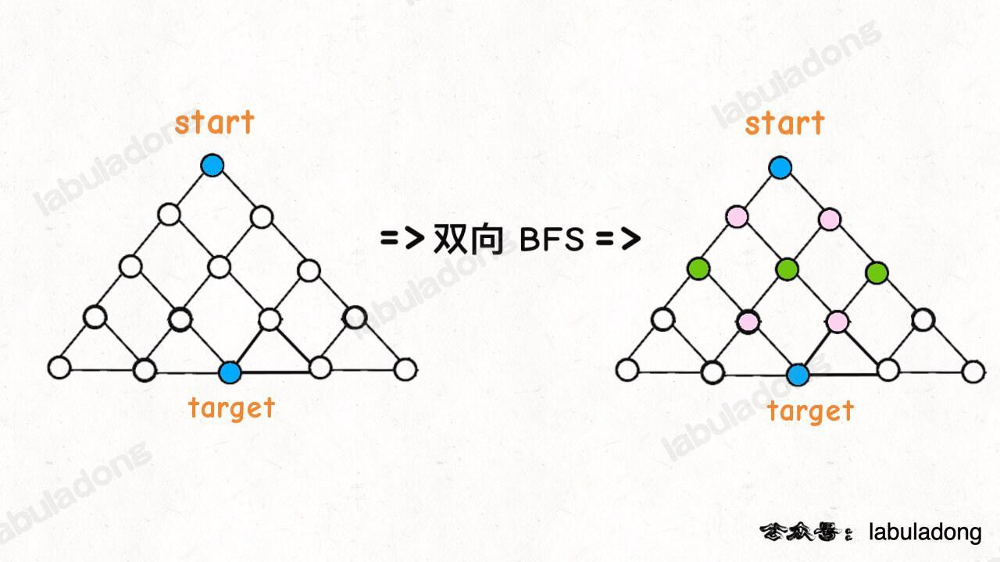
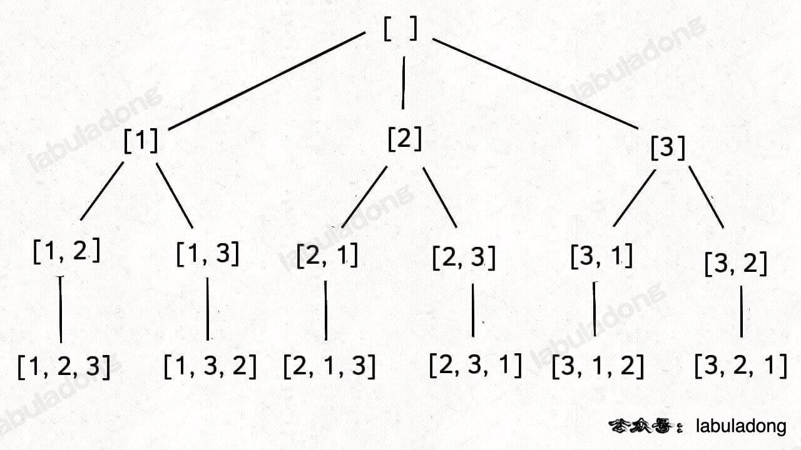
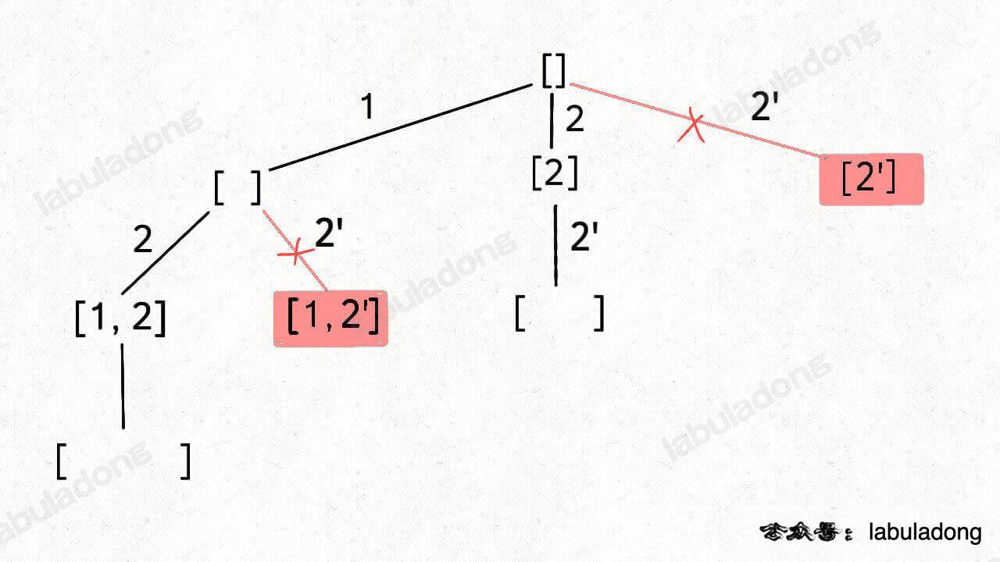
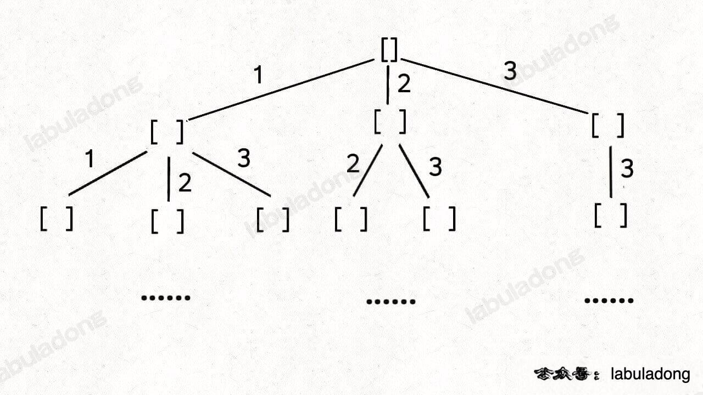

# Leetcode
this is a Leetcode submit recode


# 刷题框架总结

**递归算法的时间复杂度怎么计算？就是用子问题个数乘以解决一个子问题需要的时间**。

子问题个数就是递归树的节点数

## 数组/单链表系列算法

### 双指针

#### nsum问题

nsum问题就是从一个数组`nums`中选出能够组成`target`的n个数

框架：

```cpp
vector<vector<int>> nSumTarget(vector<int>& nums, int n, int start, int target) {
    sort(nums.begin(), nums.end());
    int sz = nums.size();
    vector<vector<int>> res;
    if (n < 2 || sz < n) return res;
    if (n == 2) {
        int left = start;
        int right = sz-1;
        while (left < right) {
            int num = nums[left] + nums[right];
            int l = nums[left];
            int r = nums[right];
            if (num > target) {
                while (left < right && nums[right] == r) right--;
            } 
            else if (num < target) {
                while (left < right && nums[left] == l) left++;
            }
            else {
                res.push_back({l, r});
                while (left < right && nums[right] == r) right--;
                while (left < right && nums[left] == l) left++;
            }
        }
    }
    else {
        for (int i = start; i < sz; i++) {
            vector<vector<int>> sub = nSumTarget(nums, n-1, i+1, target-nums[i]);
            for (vector<int>& v : sub) {
                v.push_back(nums[i]);
                res.push_back(v);
            }
            while (i < sz - 1 && nums[i] == nums[i + 1]) i++;
        }
    }
    return res;
}
```

### 递归方法

- 递归方法反转链表

  ```cpp
  // 定义：输入一个单链表头结点，将该链表反转，返回新的头结点
  ListNode* reverse(ListNode* head) {
      if (head == nullptr || head->next == nullptr) {
          return head;
      }
      ListNode* last = reverse(head->next);
      head->next->next = head;
      head->next = nullptr;
      return last;
  }
  ```

  

### 左右指针

### 二维数组的花式遍历方法

#### 顺/逆时针旋转矩阵

1. **先将 `n x n` 矩阵 `matrix` 按照左上到右下的对角线进行镜像对称**：

   

2. **再对矩阵的每一行进行反转**：

   

### 二分查找

```cpp
int BinarySearcher(vector<int>& nums, int target) {
    // 区间是左闭右闭
    int begin = 0;
    int end = nums.size()-1;
    // while中要加=
    while (begin <= end) {
        // 这里更改为这样可以有效防止(begin+end)/2中begin和end太大导致溢出
        int mid = begin + (end - begin)/2;
        if (nums[mid] == target) {
            ...
        }
        else if(nums[mid] < target) {
            begin = mid+1;
        }
        else if(nums[mid] > target) {
            end = mid-1;
        }
    }
    return ..
}
```

- 上述框架的缺陷性：不可定位到target的左右边界

#### 寻找左边边界的二分搜索

```cpp
int left_bound(vector<int>& nums, int target) {
    int left = 0, right = nums.size() - 1;
    // 搜索区间为 [left, right]
    while (left <= right) {
        int mid = left + (right - left) / 2;
        if (nums[mid] < target) {
            // 搜索区间变为 [mid+1, right]
            left = mid + 1;
        } else if (nums[mid] > target) {
            // 搜索区间变为 [left, mid-1]
            right = mid - 1;
        } else if (nums[mid] == target) {
            // 收缩右侧边界，关键点
            right = mid - 1;
        }
    }
    // 判断 target 是否存在于 nums 中
    // 此时 target 比所有数都大，返回 -1
    if (left == nums.size()) return -1;
    // 判断一下 nums[left] 是不是 target
    return nums[left] == target ? left : -1;
}
```

#### 寻找右边边界的二分搜索

```cpp
int right_bound(vector<int>& nums, int target) {
    int left = 0, right = nums.size() - 1;
    while (left <= right) {
        int mid = left + (right - left) / 2;
        if (nums[mid] < target) {
            left = mid + 1;
        } else if (nums[mid] > target) {
            right = mid - 1;
        } else if (nums[mid] == target) {
            // 这里改成收缩左侧边界即可
            left = mid + 1;
        }
    }
    // 最后改成返回 left - 1
    if (left - 1 < 0) return -1;
    return nums[left - 1] == target ? (left - 1) : -1;
}
```

#### 带权重的随机选择算法

> 前缀技巧加上二分搜索算法

把每个权重比较为一根对应长度的片段，当我们随意得到一个数字5，也就是往片段中随机扔下一个石子


但是由于preSum中没有5，因此要通过二分搜索定位到5之后的数字6，也就是下标索引3



#### 二分搜索问题的泛化

框架：

```cpp
// 函数f是关于自变量x的单调函数
int f(int x) {
    ...
}

// 主函数,在f(x)==target的约束下求x的最值
int solution(int[] nums, int target) {
    if (nums.length == 0) return -1;
    // x的最小值和最大值
    int left = ..;
    int right = ..;
    while (left <= right) {
        int mid = left+(right-left)/2;
        if (nums[mid] == target) {
            // 左边界还是右边界
        	...
        }
        else if(nums[mid] < target) {
            ...
        }
        else if(nums[mid] > target) {
            ...
        }
    }
    return left;
}
```


### 滑动窗口

```cpp
/* 滑动窗口算法框架 */
void slidingWindow(string s) {
    // 用合适的数据结构记录窗口中的数据
    unordered_map<char, int> window;
    
    int left = 0, right = 0;
    while (right < s.size()) {
        // c 是将移入窗口的字符
        char c = s[right];
        winodw.add(c)
        // 增大窗口
        right++;
        // 进行窗口内数据的一系列更新
        ...

        /*** debug 输出的位置 ***/
        // 注意在最终的解法代码中不要 print
        // 因为 IO 操作很耗时，可能导致超时
        printf("window: [%d, %d)\n", left, right);
        /********************/
        
        // 判断左侧窗口是否要收缩
        while (left < right && window needs shrink) {
            // d 是将移出窗口的字符
            char d = s[left];
            winodw.remove(d)
            // 缩小窗口
            left++;
            // 进行窗口内数据的一系列更新
            ...
        }
    }
}
```

- 设置左右指针，区间为**左闭右开**，[left, right)

#### 滑动窗口算法延伸：RABIN KARP 字符匹配算法

- 如何在数字的最低位后添加数字

  ```cpp
  // 在248后添加6
  int number = 248;
  // 进制
  int R = 10;
  // 要添加的数字
  int num = 6;
  number = number*R+num;
  ```

- 如何删除最高位的数字

  ```cpp
  // 删除2486的2
  int number = 2486;
  // 进制数
  int R = 10;
  // 最高位的数字
  int removeVal = 2;
  // 最高位的位数
  int L = 4;
  number = number - removeVal*R^(L-1);
  ```

对于字符串匹配问题，运用Rabin karp的思想，就是不要一个一个字符去暴力比较，**而是维护一个滑动窗口，将窗口内的字符都转换为一个hash数字，拿这个哈希值去和模式串的哈希值比较，这样就可以避免截取子串，从而把匹配算法降低为 `O(N)`，这就是 Rabin-Karp 指纹字符串查找算法的核心逻辑**。

```cpp
#include <string>
#include <cmath>

using namespace std;

// Rabin-Karp 指纹字符串查找算法
int rabinKarp(string txt, string pat) {
    // 位数
    int L = pat.length();
    // 进制（只考虑 ASCII 编码）
    int R = 256;
    // 取一个比较大的素数作为求模的除数
    long Q = 1658598167;
    // R^(L - 1) 的结果
    long RL = 1;
    for (int i = 1; i <= L - 1; i++) {
        // 计算过程中不断求模，避免溢出
        RL = (RL * R) % Q;
    }
    // 计算模式串的哈希值，时间 O(L)
    long patHash = 0;
    for (int i = 0; i < pat.length(); i++) {
        patHash = (R * patHash + pat.at(i)) % Q;
    }

    // 滑动窗口中子字符串的哈希值
    long windowHash = 0;

    // 滑动窗口代码框架，时间 O(N)
    int left = 0, right = 0;
    while (right < txt.length()) {
        // 扩大窗口，移入字符
        windowHash = ((R * windowHash) % Q + txt.at(right)) % Q;
        right++;

        // 当子串的长度达到要求
        if (right - left == L) {
            // 根据哈希值判断是否匹配模式串
            if (windowHash == patHash) {
                // 当前窗口中的子串哈希值等于模式串的哈希值
                // 还需进一步确认窗口子串是否真的和模式串相同，避免哈希冲突
                if (pat.compare(txt.substr(left, L)) == 0) {
                    return left;
                }
            }
            // 缩小窗口，移出字符
            windowHash = (windowHash - (txt.at(left) * RL) % Q + Q) % Q;
            // X % Q == (X + Q) % Q 是一个模运算法则
            // 因为 windowHash - (txt[left] * RL) % Q 可能是负数
            // 所以额外再加一个 Q，保证 windowHash 不会是负数

            left++;
        }
    }
    // 没有找到模式串
    return -1;
}
```

### 田忌赛马背后的算法决策

田忌赛马的升级版，如果有多匹马，那么具体的策略就是，如果自身最大的可以打得过对方的最大的，那么就对抗，如果不行则派出自身最弱的对抗对方最强的，如果抽象为两个数组：

给你输入两个**长度相等**的数组 `nums1` 和 `nums2`，请你重新组织 `nums1` 中元素的位置，使得 `nums1` 的「优势」最大化。

如果 `nums1[i] > nums2[i]`，就是说 `nums1` 在索引 `i` 上对 `nums2[i]` 有「优势」。优势最大化也就是说让你重新组织 `nums1`，**尽可能多的让 `nums1[i] > nums2[i]`**。

解法：

如果自身最大的可以打得过对方的最大的，那么就对抗，如果不行则派出自身最弱的对抗对方最强的

- 使用优先队列重新排序`nums2`的数字，但是同时需要保存数字下标
- `nums1`直接使用排序算法，每次取出`nums2`中的最大值，若`nums1`最大值(也就是右边的元素)大于最大值，则该位置上派出该最大值，否则，该位置派出`nums1`的最小值(也就是左边元素)

```cpp
struct num {
    int index;
    int val;
    num(int _index, int _val) {
        index = _index;
        val = _val;
    }
    // 默认降序，堆使用小根堆，因此重载<
    bool operator < (const num& n) const{
        return val < n.val;
    }
};
vector<int> advantageCount(vector<int>& nums1, vector<int>& nums2) {
    int n = nums2.size();
    vector<int> result(n);
    // 使用优先队列对nums2进行排序,默认降序
    priority_queue<num> maxnums2;
    for (int i = 0; i < n; i++) {
        maxnums2.push(num(i, nums2[i]));
    }
    // 对nums1进行排序
    std::sort(nums1.begin(), nums1.end());
    // 使用双指针得到最小值和最大值
    int left = 0, right = n-1;
    while (!maxnums2.empty()) {
        if (maxnums2.top().val < nums1[right]) {
            result[maxnums2.top().index] = nums1[right];
            right--;
        }
        else {
            result[maxnums2.top().index] = nums1[left];
            left++;
        }
        maxnums2.pop();
    }
    return result;
}
```

### 数组去重算法

- 使用hash

- 如果要求常数时间去重，就是双指针

- 去重+不能打乱顺序+字典序最小

  - 使用一个数组`isstack`记录是否进入栈，来保证不重复
  - 使用栈进行push和pop操作来保证不打乱顺序
  - 使用一个`count`数组来记录整个字符串每个字符出现的次数，当栈顶元素大于插入元素并且之后栈顶元素还会出现，那么就pop出去，如果栈顶元素之后不会出现`count[top] == 0`则不再pop栈顶元素

  ```cpp
  string removeDuplicateLetters(string s) {
      // 维系一个isstack数组来存储当前字符是否已经进栈
      vector<bool> isstack(256, false);
      // 维系一个栈来进行入栈出栈操作，保证顺序不变
      stack<char> sta;
      // 维系count数组来保存每个字符还有多少没有被遍历
      vector<int> count(256);
      for (char c : s) {
          count[c]++;
      }
      for (char c : s) {
          count[c]--;
          // 如果当前字符已经在栈中，则不做任何操作
          if (isstack[c]) {
              continue;
          }
          // 如果当前字符小于栈顶元素
          while (!sta.empty() && c < sta.top()) {
              if (count[sta.top()] == 0) {
                  break;
              }
              isstack[sta.top()] = false;
              sta.pop();
          }
          // 插入当前元素
          isstack[c] = true;
          sta.push(c);
      }
      string result(sta.size(), ' ');
      for (int i = sta.size()-1; i >= 0; i--) {
          result[i] = sta.top();
          sta.pop();
      }
      //result.reserve();
      return result;
  }
  ```

  

## 二叉树

思想模式分为两种：

- 是否可以通过遍历一遍二叉树得到答案，也就是**遍历**的思想
  - 对应的是**回溯算法**框架
- 是否可以定义一个递归函数，通过子问题（子树）的答案推导出原问题的答案，这就是**分解问题**的思想
  - 对应**动态规划**的核心框架

无论两种思维方式，都需要考虑：**如果单独抽出一个二叉树节点，它需要做什么事情？需要在什么时候（前/中/后序位置）做**？

**前序和后序位置辨析**

- 前序位置是只能通过父节点传来的参数进行利用
- 后序位置不仅可以获得父节点传来的数据，还能利用子节点的信息，如果一个题目与子树的信息有关，那么很大可能是后序位置

## 动态规划

求解动态规划的核心方法是**穷举**

思路：

**明确 base case -> 明确「状态」-> 明确「选择」 -> 定义 `dp` 数组/函数的含义**。

```cpp
# 自顶向下递归的动态规划
def dp(状态1, 状态2, ...):
    for 选择 in 所有可能的选择:
        # 此时的状态已经因为做了选择而改变
        result = 求最值(result, dp(状态1, 状态2, ...))
    return result

# 自底向上迭代的动态规划
# 初始化 base case
dp[0][0][...] = base case
# 进行状态转移
for 状态1 in 状态1的所有取值：
    for 状态2 in 状态2的所有取值：
        for ...
            dp[状态1][状态2][...] = 求最值(选择1，选择2...)

```

### 股票买卖问题

以最难的一个题目为例：



该问题的**状态**有三个：

- 天数
- 允许交易的最大交易数（**把一次买入和一次卖出定义为一次「交易」**）
- 当前持有的状态，也就是持有股票和没有持有股票，这里用`rest`来表示，1为持有，0为没持有

该问题的**选择**有三个：卖出、买入和保持不变，分别用`sell`，`buy`和`rest`表示

那么按照动态规划框架可以写出下面的代码：

```cpp
dp[i][k][0 or 1]
0 <= i <= n - 1, 1 <= k <= K
n 为天数，大 K 为交易数的上限，0 和 1 代表是否持有股票。
此问题共 n × K × 2 种状态，全部穷举就能搞定。

for 0 <= i < n:
    for 1 <= k <= K:
        for s in {0, 1}:
            dp[i][k][s] = max(buy, sell, rest)
```

状态转移框架：


那么对应的：

```cpp
dp[i][k][0] = max(dp[i-1][k][0], dp[i-1][k][1] + prices[i])
              max( 今天选择 rest,        今天选择 sell       )
我今天没有持有股票，有两种情况：1.昨天我就没有持有股票，我选择保持昨天的选择
2.我昨天有股票，但是我今天选择卖出股票
```

```cpp
dp[i][k][1] = max(dp[i-1][k][1], dp[i-1][k-1][0] - prices[i])
              max( 今天选择 rest,         今天选择 buy         )
我今天持有股票，有两种情况：1.昨天就持有，保持昨天的状态
2.我昨天没有持有股票，我今天选择购入股票，但是注意因为购入代表一个新的交易产生，所以我昨天的上限交易数应为k-1，不然不符合题意
```

总结一下：

```cpp
base case：
dp[-1][...][0] = dp[...][0][0] = 0
dp[-1][...][1] = dp[...][0][1] = -infinity
解释：还没开始的时候，是不可能持有股票的、不允许交易的情况下，是不可能持有股票的
因为我们的算法要求一个最大值，所以初始值设为一个最小值，方便取最大值。

状态转移方程：
dp[i][k][0] = max(dp[i-1][k][0], dp[i-1][k][1] + prices[i])
dp[i][k][1] = max(dp[i-1][k][1], dp[i-1][k-1][0] - prices[i])
```


## 回溯算法框架

回溯算法与DFS算法很相似，本质都是暴力穷举算法，但是细微的差别是：回溯算法是在遍历**树枝**，而DFS是在遍历**节点**

解决一个回溯问题，实际上就是一个决策树的遍历过程，站在回溯树的一个节点上，你只需要思考 3 个问题：

- 路径：也就是已经做出的选择。
- 选择列表：也就是你当前可以做的选择。
- 结束条件：也就是到达决策树底层，无法再做选择的条件。

```
result = []
def backtrack(路径, 选择列表):
    if 满足结束条件:
        result.add(路径)
        return
    
    for 选择 in 选择列表:
        做选择
        backtrack(路径, 选择列表)
        撤销选择

```

核心是在for循环中，在递归调用前**做选择**，结束递归调用后**撤销选择**

### 排列-组合-子集问题

无论是排列、组合还是子集问题，简单说无非就是让你从序列 `nums` 中以给定规则取若干元素，主要有以下几种变体：

- 元素无重不可复选，也就是`nums`的元素是都是唯一的，并且只能选择一次。
  - 以组合为例，如果输入 `nums = [2,3,6,7]`，和为 7 的组合应该只有 `[7]`。
- 元素可重不可重选，也就是输入`nums`的元素是不唯一的，但是每一个元素只能选择一次。
  - 以组合为例，如果输入 `nums = [2,5,2,1,2]`，和为 7 的组合应该有两种 `[2,2,2,1]` 和 `[5,2]`。

- 元素无重可重选，也就是输入`nums`的元素是唯一的，但是可以被重复选择
  - 以组合为例，如果输入 `nums = [2,3,6,7]`，和为 7 的组合应该有两种 `[2,2,3]` 和 `[7]`。

**但无论形式怎么变化，其本质就是穷举所有解，而这些解呈现树形结构，所以合理使用回溯算法框架，稍改代码框架即可把这些问题一网打尽**。





#### 元素无重不可复选

##### 子集

满足该子集树，在前序位置就是一个结果，加入结果列表，选择列表是当前元素之后的元素依次加入，后序位置是撤销选择


##### 组合

当我们通过上面的子集得到所有的组合结果之后，就可以根据题目要求进行题目的更改

##### 排列

前序位置，当走到叶节点（也就是当前路径数组长度等于nums长度）时加入结果数组中，选择列表就是nums中所有没有被遍历过的节点（使用used数组来保存是否被遍历条件），后序位置撤销选择，也要更改used数组



#### 元素可重不可重选

##### 子集/组合问题

按照上面的元素不重不可复选框架进行剪枝，需要先对数组进行排序（让重复的元素挨在一起），当遇到重复元素时就遍历第一条，其余都跳过



##### 排列问题

你对比一下之前的标准全排列解法代码，解法代码只有两处不同：

1、对 `nums` 进行了排序。

2、添加了一句额外的剪枝逻辑。

#### 元素无重可重选

##### 子集/组合

在之前的无重不可复选时保证不可复选的方式是在向下递归调用时使用一个`start`变量，定义下一层从当前的`start+1`开始，那么这里只需要将下一层同样也设为`start`即可保证可以复选



## BFS算法框架

BFS广度优先算法，**问题的本质就是让你在一幅「图」中找到从起点 `start` 到终点 `target` 的最近距离**

实现使用队列queue

```cpp
// 返回从起点到终点的最近距离
int BFS(Node start, Node target) {
    queue<Node> q;
    unordered_set<Node> visited; // 避免重复走
    
    q.push(start);
    visited.insert(start);
    int step; // 记录扩散的步数
    while (!q.empty()) {
        int sz = q.size();
        for (int i = 0; i < sz; i++) {
            Node cur = q.front();
            q.pop();
            if (cur == target) {
                return step;
            }
            /* 将 cur 的相邻节点加入队列 */
            for (Node n : cur.adj()) {
                if (visited.count(n) == 0) {
                    q.push(n);
                    visited.insert(n);
                }
            }
        }
        /* 划重点：更新步数在这里 */
        step++;
    }
}
```

- DFS 是线，BFS 是面；DFS 是单打独斗，BFS 是集体行动。
- BFS 可以找到最短距离，但是空间复杂度高，而 DFS 的空间复杂度较低。

### 双向BFS优化

**传统的 BFS 框架就是从起点开始向四周扩散，遇到终点时停止；而双向 BFS 则是从起点和终点同时开始扩散，当两边有交集的时候停止**。

- 时间复杂度分析：两个最坏的时间复杂度都为O(n)，但是实际上双向会更快一点

  

  可以看出使用双向遍历的节点数更少

  

- 但是使用双向BFS的前提是知道终点
