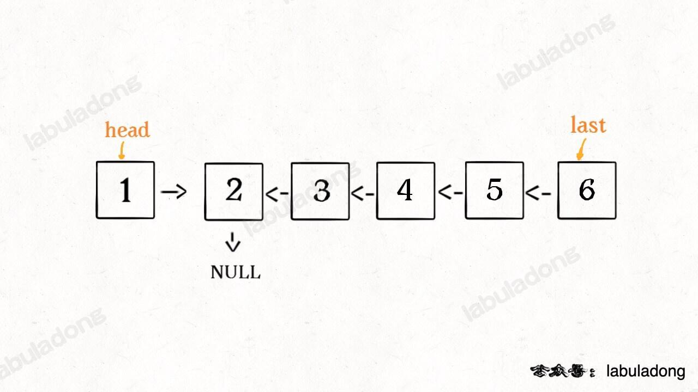
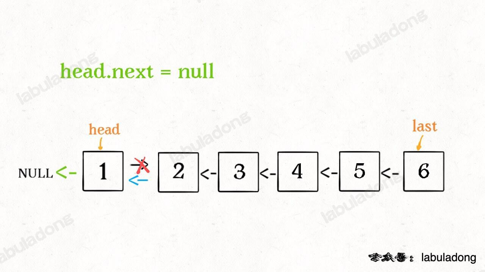
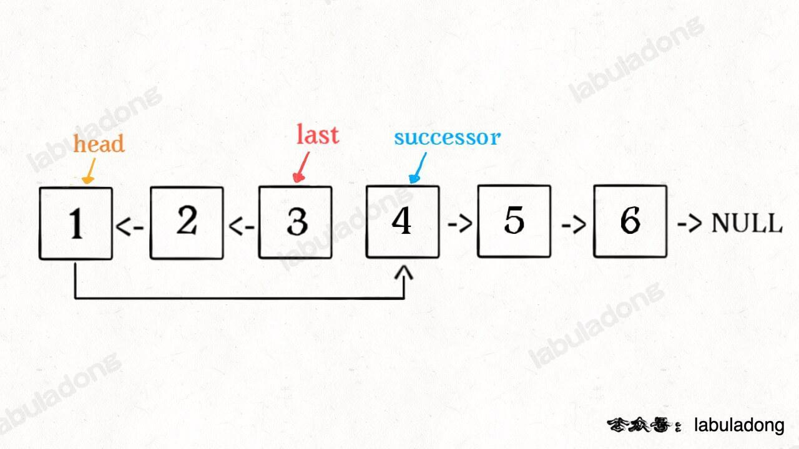
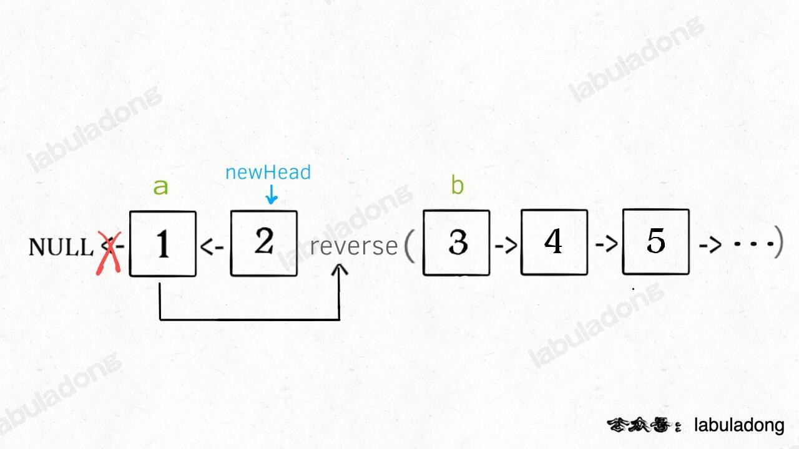

## 数组/单链表系列算法

### 链表

#### 双指针

|                             题目                             | 难度 |   题解   |
| :----------------------------------------------------------: | :--: | :------: |
| [21.合并两个有序链表](https://leetcode.cn/problems/merge-two-sorted-lists/) | 简单 |          |
| [876. 链表的中间结点](https://leetcode.cn/problems/middle-of-the-linked-list/) | 简单 | 快慢指针 |
| [19. 删除链表的倒数第 N 个结点](https://leetcode.cn/problems/remove-nth-node-from-end-of-list/) | 中等 | 快慢指针 |
| [141. 环形链表](https://leetcode.cn/problems/linked-list-cycle/) | 简单 | 快慢指针 |
| [142. 环形链表 II](https://leetcode.cn/problems/linked-list-cycle-ii/) | 中等 |          |

#### 递归—反转链表

|                             题目                             | 难度 |            题解             |
| :----------------------------------------------------------: | :--: | :-------------------------: |
| [206. 反转链表](https://leetcode.cn/problems/reverse-linked-list/) | 简单 |       递归/非递归 206       |
| [92. 反转链表 II](https://leetcode.cn/problems/reverse-linked-list-ii/) | 中等 | 递归，基于反转前N个节点链表 |
| [25. K 个一组翻转链表](https://leetcode.cn/problems/reverse-nodes-in-k-group/) | 困难 |                             |

##### 206 反转链表，递归算法

对于一个初始的链表：1->2->3->4->5->6->NULL

当我们调用递归`reverse(head->next)`，会导致一下情况的出现（直接考虑结果即可）



那么我们只需要对当前的结果进行处理即可

```cpp
reverse(ListNode* head) {
    if (!head || !head->next) {
        return head;
    }
    ListNode* last = reverse(head->next);
    head->next->next = head;
    head->next = nullptr;
    return last;
}
```



##### 92 反转链表Ⅱ，递归算法

反转从位置 `left` 到位置 `right` 的链表节点，返回 **反转后的链表**

首先考虑反转前N个节点，整体与上面的反转链表没有太大差异

```cpp
ListNode* tail = nullptr;
ListNode* reverseN(ListNode* head, int n) {
    if (n == 1) {
        tail = head->next;
        return head;
    }
    ListNode* last = reverse(head->next, n-1);
    head->next->next = head;
    head->next = tail;
    return last;
}
```



那么对于反转两个变量中间，就考虑当left为1的时候，就简化为上面的反转前N个节点；当left不为1的时候，那么对于当前节点，对于之后的节点调用函数，此时head->next = 之后翻转的头节点

```cpp
ListNode* reverseBetween(ListNode* head, int left, int right) {
    if (left == 1) {
        return reverseN(head, right);
    }
    head->next = reverseBetween(head->next, left-1, right-1);
    return head;
}
```

##### 25 K个一组翻转链表

给你链表的头节点 `head` ，每 `k` 个节点一组进行翻转，请你返回修改后的链表

- 首先反转以head开头的前K个
- 将第 `k + 1` 个元素作为 `head` 递归调用 `reverseKGroup` 函数
- 将上面的结果链接起来

```cpp
ListNode* reverseKGroup(ListNode* head, int k) {
    // 首先反转前k个节点
    ListNode* tail = head;
    for (int i = 0; i < k; i++) {
        // 剩余的长度小于k，则不反转直接返回
        if (!tail) return head;
        tail = tail->next;
    }
    // 翻转从[head, tail)部分的节点
    ListNode* newhead = Reverse(head, tail);
    // 调用递归翻转后面的部分
    head->next = reverseKGroup(tail, k);
    return newhead;
}
```



### 数组

|                             题目                             | 难度 | 题解 |
| :----------------------------------------------------------: | :--: | :--: |
| [26. 删除有序数组中的重复项](https://leetcode.cn/problems/remove-duplicates-from-sorted-array/) | 简单 |      |
| [27. 移除元素](https://leetcode.cn/problems/remove-element/) | 简单 |      |
|                                                              |      |      |

### nsum问题

|                         题目                         | 难度 | 题解 |
| :--------------------------------------------------: | :--: | :--: |
| [1. 两数之和](https://leetcode.cn/problems/two-sum/) | 简单 |      |
|  [15. 三数之和](https://leetcode.cn/problems/3sum/)  | 中等 |      |
|  [18. 四数之和](https://leetcode.cn/problems/4sum/)  | 中等 |      |

#### 左右指针

- 二分查找
- 滑动窗口

|                             题目                             | 难度 |        题解        |
| :----------------------------------------------------------: | :--: | :----------------: |
| [167. 两数之和 II - 输入有序数组](https://leetcode.cn/problems/two-sum-ii-input-array-is-sorted/) | 中等 |      左右指针      |
| [5. 最长回文子串](https://leetcode.cn/problems/longest-palindromic-substring/) | 中等 | 中间扩散的左右指针 |
|                                                              |      |                    |

